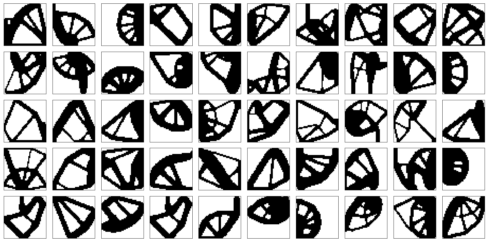
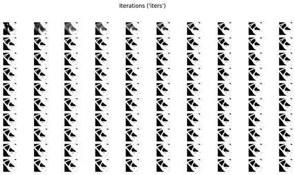
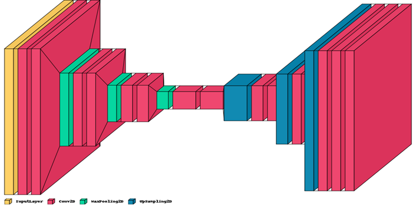
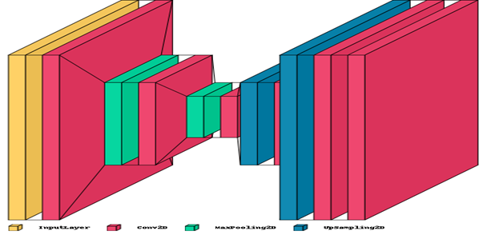
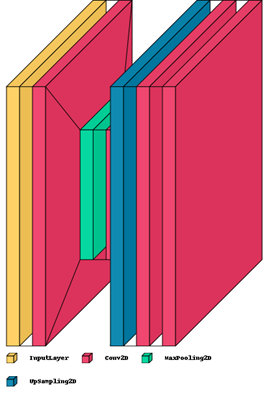
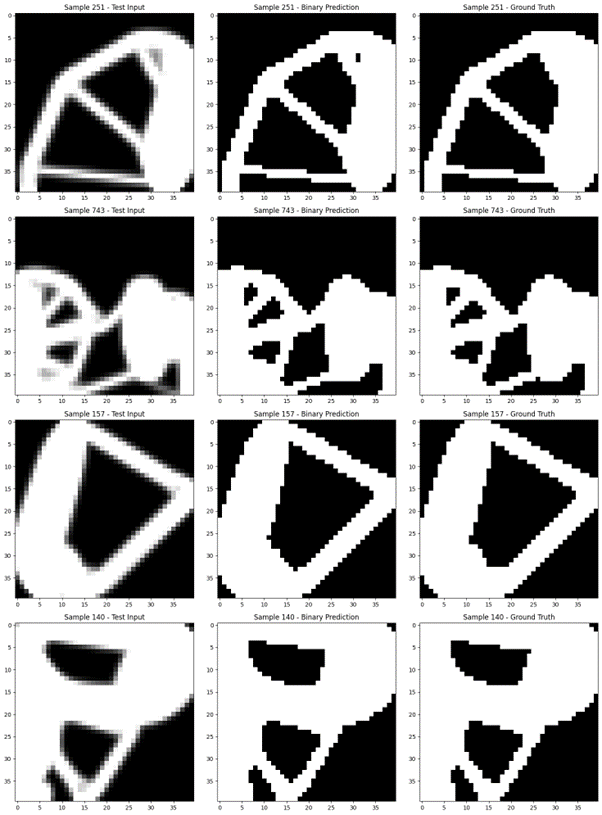
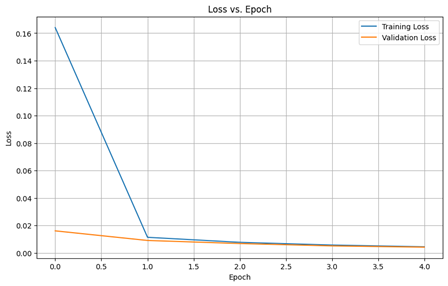
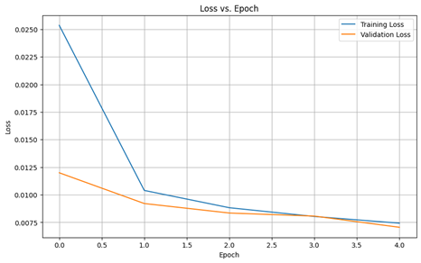
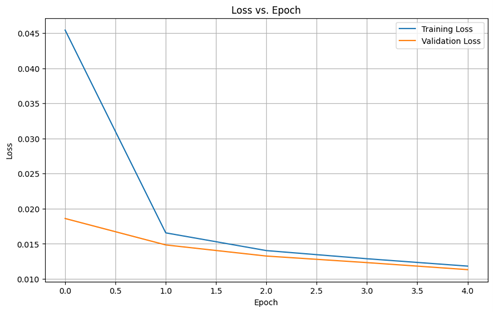
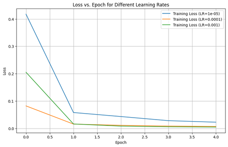

# Machine Learning Models for Topology Optimization

## Overview
This project explores the integration of Machine Learning (ML) and Deep Learning (DL) techniques in the field of topology optimization. Leveraging the TOP dataset, the study presents a comprehensive approach to optimizing structural designs using advanced neural network architectures.

### Key Features
- Utilization of the TOP dataset comprising 10,000 scenarios for robust ML model training.
- Implementation of various neural network architectures, including an Encoder-Decoder Net model inspired by the U-Net architecture.
- Detailed analysis of neural network performance in structural optimization tasks.

## Neural Network Architectures
1. **Encoder-Decoder Net Model**: A complex model designed for detailed image processing.
2. **Smaller Network**: A streamlined version of the U-Net architecture, offering a compact design.
3. **Tiny Neural Network**: A lightweight model, ideal for simpler tasks.

## Dataset
The TOP dataset consists of solutions for 10,000 randomly generated scenarios on a 40×40 grid. It provides a detailed view of the optimization process over 100 iterations, ensuring a thorough understanding of topology optimization challenges.

## Neural Network Architecture
The project demonstrates the effectiveness of ML models in topology optimization. Various architectures were used and evaluated, and their performances were compared in terms of optimization efficiency and accuracy.

## Results

- Loss vs Epochs Plot

- Loss vs Epochs for different learning rates

## Contributions
Contributions to this project are welcome. Please read the contribution guidelines before submitting your contributions.
